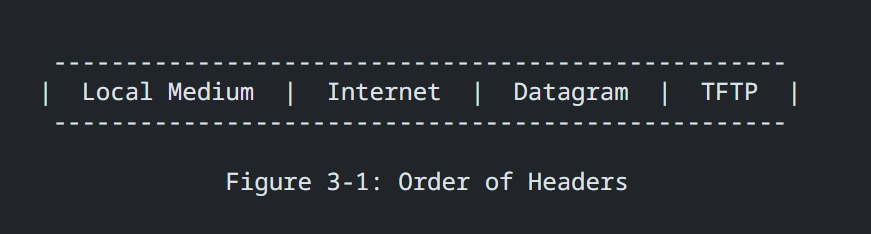

# Compte rendu, BLARET Julien LABROUSSE Sédrenn
2G1 TD3 TP6 | ENSEA 2024

## TP de Synthèse –  client TFTP

**Objectifs :** Réaliser un client TFTP, à l’aide des RFC et de captures wireshark

## Résumé documentation 
Pour commmencer nous avons beaucoup de documentation à lire, nous allons essayer de récupérer les informations importantes pour nous ci-dessous.

### THE TFTP PROTOCOL

#### Messages définis dans le protocole ou requètes :

- **RRQ (Read Request) :** Demande de lecture d'un fichier.
- **WRQ (Write Request) :** Demande d'écriture d'un fichier.
- **DATA :** Bloc de données à transmettre.
- **ACK (Acknowledgment) :** Accusé de réception pour confirmer la réception d'un bloc.
- **ERROR :** Message d'erreur.

