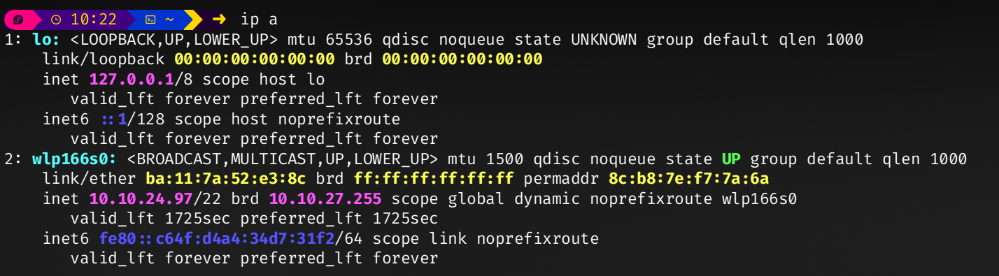

# Compte rendu, BLARET Julien LABROUSSE Sédrenn
2G1 TD3 TP6 | ENSEA 2024

## TP de Synthèse –  client TFTP

**Objectifs :** Réaliser un client TFTP, à l’aide des RFC et de captures wireshark

## Résumé documentation 
Pour commmencer nous avons beaucoup de documentation à lire, nous allons essayer de récupérer les informations importantes pour nous ci-dessous.

### THE TFTP PROTOCOL
Trivial File Transfer Protocol plus simple
basé su rle protocole UDP

#### Messages définis dans le protocole ou requètes :

- **RRQ (Read Request) :** Demande de lecture d'un fichier.
- **WRQ (Write Request) :** Demande d'écriture d'un fichier.
- **DATA :** Bloc de données à transmettre.
- **ACK (Acknowledgment) :** Accusé de réception pour confirmer la réception d'un bloc.
- **ERROR :** Message d'erreur.

*1. Host A sends  a  "WRQ"  to  host  B  with  source=  A's  TID, destination= 69.* 69 car Request 

*2. Host  B  sends  a "ACK" (with block number= 0) to host A with source= B's TID, destination= A's TID.*

Nous sommes à l'adresse du serveur 127.0.0.1 port 69 (soit le localhost)

Comme indiqué dans la photo ci-dessous : 

### Question 1 : [code question 1](../gettftp/q1.c)

Nous sommes en Sockdiagram pour le socket 

Dans cette partie, nous ne faisons "que" initier les variables/les informations du port sur lequel nous nous connectons : l'adresse IP du serveur$, l'adresse du port utilisé le nom du fichier. 
En lancant la fonction on récupère également une quatrième variable, le nombre d'infos passées.

Nous utilisons cette variable pour vérifier les arfuments et prévenir directement en cas d'erreur.

### Question 2 : [code question 2](../gettftp/q2.c)

Pour chercher l'adresse du fichier nous utilisons get addrinfo qui renvoie entre autre l'adresse IP, le port et une piste pour de potentiels socket. 

A ce stade nous avons eu un segfault. Pour le contourner nous nous sommes conecté sur un serveur local à notre machine. PLutôt qu'un réseau classique. Mais ce n'est qu'un paliatif.

On a tenté d'utiliser la fonction strcat. Mais elle ne permet pas d'injecter des 0 en fin de chaine de caractère, ce qui est nécessaire pour le bon déroulé du code.

